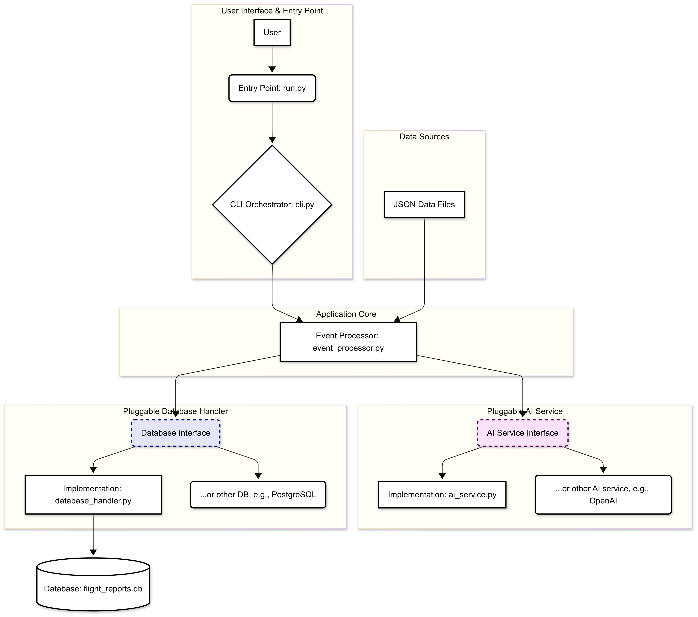

# Flight Report Assistant

## Overview

The "Flight Report Assistant" is a command-line application designed to process various flight-related events from text-based inputs. Using AI models, it summarizes, structures, and categorizes these events, creating insightful reports for training or maintenance purposes. The application can handle heterogeneous text formats from sources like instructor pilot notes, onboard event logs, maintenance reports, and simulator observations.

## Features

-   **Ingest Data:** Reads flight events from multiple JSON source files with different structures (e.g., `events_ops.json`, `events_tech.json`).
-   **AI-Powered Processing:** Utilizes an AI service to:
    -   Generate a concise **summary** of the event.
    -   Assign an **event category** (e.g., "Flight Ops", "Avionics", "Weather").
    -   Determine a **severity level** (low, medium, high, critical).
    -   Provide a **recommendation** (e.g., "monitor closely", "maintenance check required").
-   **Data Storage:** Stores the normalized and enriched records in a local SQLite database.
-   **Command-Line Interface (CLI):** Offers a user-friendly CLI to interact with the stored data.
-   **Extensible Architecture:** Designed with a pluggable architecture, allowing for easy integration of different AI providers (e.g., OpenAI, Hugging Face) or database systems (e.g., PostgreSQL) by adhering to a common interface.

## Architecture

The application is built with a modular and extensible architecture, separating concerns into distinct components:

-   **User Interface (CLI):** `assistant/cli.py` provides the command-line interface for user interaction.
-   **Orchestrator:** `run.py` is the main entry point of the application.
-   **Event Processor:** `assistant/event_processor.py` handles the logic for reading, parsing, and processing the input files.
-   **Pluggable AI Service:** `assistant/ai_service.py` defines an abstract interface for AI services and includes a mock implementation for testing and a Hugging Face implementation for production.
-   **Pluggable Database Handler:** `assistant/database_handler.py` defines an interface for database operations and provides an SQLite implementation.
-   **Data Sources:** Raw data is ingested from JSON files located in the `data/` directory.



## Requirements
-   **Python 3.12** is required to run this application.

## Setup and Installation

1.  **Clone the repository:**
    ```bash
    git clone git@github.com:lalagi/FlightReportAssistant.git
    cd FlightReportAssistant
    ```

2.  **Create a virtual environment**
    ```bash
    python -m venv venv
    source venv/bin/activate  # On Windows, use `venv\Scripts\Activate.ps1`
    ```

3.  **Install the dependencies:**
    ```bash
    pip install -r requirements.txt
    ```

## Configuration

The application's behavior can be configured through the `config.yaml` file. You can switch between different AI services or database handlers.

### AI Service

To switch the AI service, modify the `active_service` key under `ai_service`.

-   **Mock Service:** Uses a simple rule-based system for testing purposes.
    ```yaml
    ai_service:
      active_service: mock
    ```

-   **Hugging Face Service:** Uses pre-trained models from the Hugging Face Hub. Make sure to specify the model names and other parameters.
    ```yaml
    ai_service:
      active_service: huggingface
      huggingface:
        models:
          summary_model: "microsoft/phi-2"
          category_model: "facebook/bart-large-mnli"
          severity_model: "facebook/bart-large-mnli"
          recommendation_model: "microsoft/phi-2"
    ```

### Database

The active database handler can be configured under the `database` section. The default is SQLite.

## Usage

1. Initialize the database (optional since ingesting does this step automatically):

    ```bash
    python run.py init
    ```

2. Ingest data:
    ```bash
    python run.py ingest data/event_ops.json data/event_tech.json
    ```

3. Get statistics:
    ```bash
    python run.py stats category
    ```

4. List reports by severity:
    ```bash
    python run.py list --severity high
    ```

5. List reports by severity:
    ```bash
    python run.py show --id <your-report-id>
    ```